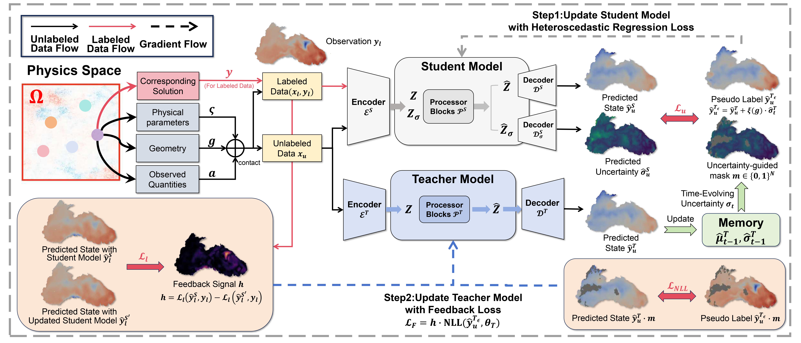
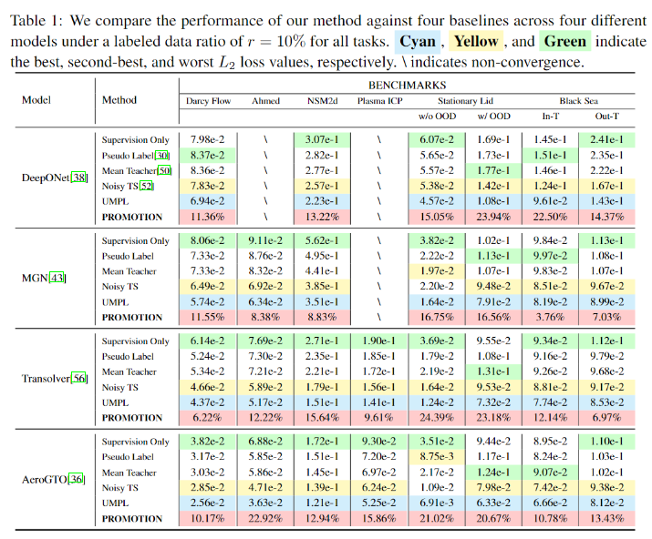

# UMPL(NeurIPS 2025)
**UMPL: Uncertainty-Informed Meta Pseudo Labeling for Surrogate Modeling with Limited Labeled Data**

In this work, we propose UMPL, a unified semi-supervised learning framework designed to enhance surrogate modeling under limited labeled data. While neural operators offer efficient alternatives to costly simulations, their reliance on large labeled datasets restricts their applicability in scientific domains. UMPL mitigates this issue by leveraging unlabeled data through uncertainty-informed pseudo-labeling. Specifically, the teacher model generates pseudo labels guided by epistemic uncertainty, while the student provides feedback based on aleatoric uncertainty, forming a meta-learning loop that improves pseudo-label quality and model generalization. Notably, UMPL is model-agnostic and can be integrated into diverse architectures to handle distribution shifts and out-of-distribution scenarios. Extensive evaluations across seven tasks show that UMPL achieves up to 14.18% improvement with only 10% labeled data, consistently outperforming strong semi-supervised baselines.



**Overview of the UMPL pipeline.** UMPL leverages both labeled and unlabeled data to enhance generalization under distribution shifts. The teacher generates pseudo labels via epistemic uncertainty, while the student learns from predicted states and their corresponding aleatoric uncertainties using heteroscedastic regression loss. The teacher is iteratively refined with feedback from the student’s performance on labeled data, forming a closed-loop training process that progressively improves pseudo-label quality. Both the teacher and student can be versatile forecasting models.


**Performance Comparison.** Table 1 presents the performance of UMPL across three representative tasks under limited-label conditions. On steady-state datasets (Darcy Flow, Ahmed Body) and the transient dataset (NSM2d), UMPL consistently outperforms all baselines, yielding an average improvement of $12.13\%$ over the second-best approach. In out-of-distribution scenarios (Stationary Lid, Black Sea), UMPL achieves the lowest $L_2$ errors both within and beyond the training distribution, surpassing the second-best method by $20.19\%$ and $11.37\%$, respectively. Likewise, distribution shift benchmarks (Time-dependent Lid2d and Plasma ICP) demonstrate superior performance. These results collectively highlight the method’s strong generalization capability and data efficiency.

<p align="center">
  
</p>

## Get Started

Our model is designed for semi-supervised surrogate modeling, aiming to improve prediction accuracy by effectively leveraging unlabeled data. In this repository, we demonstrate its application using the Stationary Lid dataset as an example.

 Please maintain the file structure shown below to run the script by default：

```sh
The project
|
└─── config
|      ...
└─── dataset
|      └─── labeled_dataset
|      └─── unlabeled_dataset
|      └─── test_dataset
|      ...
└─── src
|      └─── model.py
|      └─── dataset.py
|      └─── loss.py
|      └─── train.py
|      ...
|    main.py
|    utils.py
```


Add dataset folder if it does not exist, add data to corresponding dataset. You should change the environment settings in the file according to your own hardware configuration.

Before training, we first perform supervised learning on the labeled data and save the resulting model weights as the initial parameters for both the teacher and student models.


**Data Format:**

The geometry format of our dataset should be as follows:

```python
Node_pos = [
    [X1, Y1, Z1],
    [X2, Y2, Z2],
   ...
]
Cells = [
    [p1, p2, p3],
    [p4, p5, p6],
   ...
]
```
- **X,Y,Z**: (N_points x 3) numpy array(2D or 3D), representing input mesh points. X_dim, Y_dim, Z_dim are input dimensions of geometry.

- **Cells**: (N_cells x 3) numpy array, representing Geometric Cells, which contains three points. The minimum index is `0`, and the maximum value is `N_points-1`. For point-based models, cell information is not required.

- **Note**:
    I. For a single sample, The number of points must match, i.e, ``X.shape[0]=Y.shape[0]``.
    II. If additional preprocessing is required for the data, please modify it in the corresponding dataset file in the directory `code/src`

The field input and parameters should be as follows:

```python
input_state1 = [
    [a1, a2, a3...],
    [a4, a5, a6...],
   ...
]
input_state2 = [
    [b1, b2, b3...],
    [b4, b5, b6...],
   ...
]
...
```
- **input_field**: (N_points x C) numpy array, representing the input fields. For scalar parameters, we use broadcasting to replicate the value at each point as part of the input.

## Requirements

- torch==2.1.0
- torch_scatter==2.1.0
- numpy==1.24.3
- pandas==2.0.1
- plyfile==0.7.4
- h5py==3.9.0
- vtk==9.2.6
- tensorboardX==2.6

## Contact
If you have any questions or want to use the code, please contact 12332063@zju.edu.cn.


